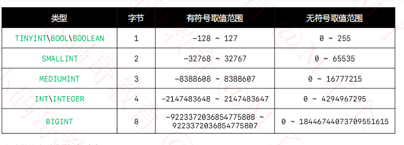
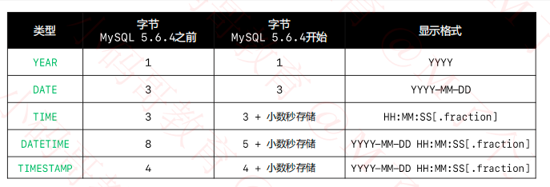

## MySQL 下载

下载安装MySQL服务器软件：MySQL Community Server （社区版）

常用版本：5.7、8.0

下载地址
windows: https://downloads.mysql.com/archives/installer/

mac: https://downloads.mysql.com/archives/community/

官方文档：https://dev.mysql.com/doc/
## MySQL的使用步骤

### 登录、连接MySQL服务器
```shell
mysql -uroot -p密码
```
或者换行输入密码
```shell
mysql -uroot -p
```

## 常用数据类型

### 数字类型


上述整数类型的使用格式为：TYPE[M] [UNSIGNED] [ZEROFILL]

- `UNSIGNED`：无符号
- `ZEROFILL`：等价于 `UNSIGNED ZEROFILL`, 表示在显示数值时，若数字不足M位，就在前面用0填充


### 字符串类型


### 日期和时间类型



从MySQL 5.6.4开始，允许`TIME\DATATIME\TIMESTAMP` 有小数部分，需要3～3字节的储存

`DATATIME`支持的范围：1000-01-01 00:00:00.000000到9999-12-31 23:59:59.999999

`TIMESTAMP`支持范围：1970-01-01 00:00:00.000000带2038-01-19 03:14:07.999999

#### DATATIME\TIMESTAMP 的自动设置
- `DEFAULT CURRENT_TIMESTAMP` 当插入记录时，如果没有指定时间值，就设置时间为当前的系统时间
- `NO UPDATE CURRENT_TIMESTAMP` 当修改记录时，如果没有指定时间值，就设置时间为当前的系统时间


## SQL语句

SQL语句：Structured Query Language的简称，译为 "结构化查询语言"，用于操作关系型数据库

### SQL语句分类
主要分为4大类
- DDL：数据定义语言，创建（CREATE）、修改（ALTER）、删除（DROP）数据库\表
- DQL：数据查询语言，查询记录（SELECT）
- DML：数据操纵语言，增加（INSERT）、删除（DELETE）、修改（UPDATE）
- DCL：数据控制语言，控制访问权限（GRANT、REVOKE）

### 语法格式
- 每一条语句是分号（;）结束
- 不区分大小写，建议：关键字大写，其他使用小写，单词之间用下划线连接，比如my_firstname
- 注释
  - 单行注释：---注释内容--- 或者 #注释内容
  - 多行注释 `/*注释内容*/`


### DDL语句

#### 数据库

##### 创建
- `CREATE DATABASE` 数据库名 #创建数据库（使用默认的字符编码）
- `CREATE DATABASE` 数据库名 CHARACTER SET 字符编码 # 创建数据库（使用指定的字符编码
- `CREATE DATABASE` IF NOT EXISTS 数据库名 # 如果不存在则创建
- `CREATE DATABASE` IF NOT EXISTS 数据库名 CHARACTER SET 字符编码 

#### 查询数据库
- `SHOW DATABASE` # 查询所有的数据库
- `SHOW CREATE DATABASE` 数据库名  # 查询数据库的创建语句
- `USE` 数据库名  # 使用数据库
- `SELECT DATABASE()` #查询正在使用的数据库

#### 修改
`ALTER DATABASE` 数据库名 `CHARACTER SET` 字符编码  # 修改数据库的字符编码
#### 删除
- `DROP DATABASE` 数据库名
- `DROP DATABASE IF EXISTS` 数据库名 # 如果这个数据库存在，才删除

#### 表

##### 创建
CREATE TABLE 表名(
    列名1 数据类型1，
    列名2 数据类型2
)

##### 查询
- `SHOW TABLES` # 查询当前数据库的所有表
- `DESC` 表名 # 查看表结构
##### 删除

- `DROP TABLE` 表名
- `DROP TABLE IF EXISTS` 表名  # 如果这个表存在，才删除它

##### 修改

- `ALTER TABLE` 表名 `REAME TO` 表名
- `ALTER TABLE` 表名 `CHARACTER SET` 字符编码 # 修改表格的字符编码
- `ALTER TABLE` 表名 `ADD` 列名 数据类型 #增加新的一列
- `ALTER TABLE` 表名 `MODIFY` 列名 新数据类型 # 修改某一列的数据类型
- `ALTER TABLE` 表名 `CHANGE` 列名 新列名 新数据类型 # 修改某一列的列名、数据类型
- `ALTER TABLE` 表名 `DROP` 列名 # 删除某一列

### DML语句

#### 增加
- `INSERT INTO ` 表名 (列名1, 列名2, ..., 列名n) `VALUES` (值1,值2, ...,值n) # 非数字类型的值，一般需要用引号括住（单引号或双引号，建议使用单引号）
- `INSERT INTO ` 表名 `VALUES` (值1, 值2, ..., 值n) # 从左至右按顺序给所有列添加值

#### 修改
- `UPDATE` 表名 `SET` 列名1 = 值1，列名2 = 值2, ..., 列名n = 值n [WHERE 条件] # **如果没有添加条件，将修改表中的所有记录**

#### 删除
- `DELETE FROM` 表名 [WHERE 条件] # 如果没有添加条件，将会删除表中的所有记录

#### TRUNCATE

如果要删除表中的所有数据（保留表结构），有2中常见做法
- `DELETE FROM` 表名 #逐行删除每一条记录
- `TRUNCATE` [TABLE] 表名 # 先删除后重新创建表（效率高）
  
  TRUNCATE 归类为DDL语句，而不是DML语句，为了实现高性能，它绕过删除数据DML方法，因此，它不能被回滚，不会导致ON DELETE触发器触发，并且不能对InnoDB具有父子外键关系的表执行

### DQL

```sql
SELECT [DISTINCT] 列名1, 列名2, ..., 列名n
FROM 表名
[WHERE ...]
[GROUP BY ...]
[HAVING ...]
[ORDER BY ...]
[LIMIT ...]
```

`SELECT * FROM customer` # 查询表中所有记录

`SELECT DISTINCT * FROM customer`  # 查询表中的所有记录 （去除了重复的记录）

#### 聚合函数 （Aggregate Function）
`SELECT COUNT(*) FROM customer` # 查询表中的记录总数

`SELECT COUNT(phone) FROM custom` # 查询表中phone的总数（不包括NULL）

`SELECT COUNT(DISTINCT phone) FROM customer` # 查询表中phone的总数（不包含NULL，去除了重复记录）

`SELECT SUM(salary) FROM customer` #计算所有salary的总和

`SELECT MIN(age) FROM customer` # 查询最下的age

`SELECT MAX(age) FROM customer` # 查询最大的age

`SELECT AVG(salary) FROM customer` # 计算所有salary 的平均值

#### 常见的WHERE子句

##### 比较运算
`WHERE age > 18`  # 大于

`WHERE age <= 30`

`WHERE age = 20`

`WHERE name = '张三‘`

`WHERE age != 25`

`WHERE age <> 25` # age 不等于25

`NULL` 值判断（不能用 =、!=、<>）

`WHERE phone IS NULL` # phone的值为NULL

`WHERE phone IS NOT NULL` # phone 的值不为NULL

##### 逻辑运算

`WHERE age > 18 AND age <= 30` 或 `WHERE age > 18 && age <= 30`

`WHERE age BETWEEN 20 AND 30` # age 大于等于20并且小于等于30

`WHERE age = 18 OR age = 20 OR age = 22` # age 等于18或者等于20或者等于22

`WHERE age IN (18, 28, 22)`  # age 等于18或者等于20或者等于22

`WHERE NOT (age < 18)` # 大于等于18

`WHERE ! (age < 18)` # age 大于等于18

##### 模糊查询 （_ 代表单个任意字符，%代表任意个任意字符）
`WHERE name LIKE '_码_'` # name 是3个字符并且中间是'码'字

`WHERE name LIKE '___'` # name 是3个字符

`WHERE name LIKE '李%`   # name 是以'李'字开头

`WHERE name LIKE '_码%'` # name 的第二个字符 '码' 字

`WHERE name LIKE '_码%'` # name 的第二个字符是 '码' 字

`WHERE name LIKE '%码%'` # name 中的包含 '码' 字


### 表复制

创建一张拥有相同表结构的空表（只复制表结构，不复制记录）

`CREATE TABLE new_table LIKE old_table`

创建一张拥有相同的表结构、相同记录的表（复制表结构、复制记录）

`CREATE TABLE new_table AS (SELECT * FROM old_table)`

可以省略AS

### 列的常用属性

- `NOT NULL`: 不能设置为NULL值

- `COMMENT`: 注释

- `DEFALUT`: 默认值(BLOB、TEXT、GEOMETRY、JSON 类型不能有默认值)

- `AUTO_INCREMENT`：自动增长 
  - 适用于 `INT、FLOAT、DOUBLE` 类型
  - 在插入记录时，如果不指定此列的值或设置为NULL，会在此前的基础上自动增长1
  - 不能有默认值（不能使用DEFAULT）
  - 在一个表格中，最多只能有一列被设置为AUTO_INCREMENT
  - 这一列必须被索引（`UNIQUE` `PRIMARY` 、 `FOREIGN KEY` 等）

#### UNIQUE 索引

一旦某一列被设置列`UNIQUE`索引，该列的所有值必须时唯一的，允许存在多个NULL值

2种常见写法

- 列名 数据类型 UNIQUE [KEY]
- UNIQUE [KEY] (列名)

```sql
CREATE TABLE student (
  id INT UNIQUE,
  name VARCHAR(20),
  UNIQUE (name)
);
```

#### 主键 （PRIMARY KEY）

主键的作用：可以保证在一张表中的每一条记录都是唯一的
- 如果将某一列设置为主键，那么这一列相当于加上了 `NOT NULL UNIQUE`
- 建议每一张表都有主键
- 主键最好根业务无关，常设置为 `INT AUTO_INCREMNET`

2种写法
- 列名 数据类型 [PRIMARY] KEY
- [PRIMARY] KEY (列名)

```sql
CREATE TABLE company(
    id INT AUTO_INCREMENT PRIMARY KEY,
    name VARCHAR(20) NOT NULL UNIQUE 
);
```
建议下面这种写法
```sql
CREATE TABLE company (
    id INT AUTO_INCREMENT,
    name VARCHAR(20) NOT NULL UNIQUE ,
    PRIMARY KEY (id)
);
```

#### 外键

一般用外键来引用其他表的主键，常见写法

`FOREIGN KEY (列名) REFERENCE 表名 （列名）`

```sql
CREATE TABLE company(
  id INT AUTO_INCREMENT PRIMARY KEY ,
  name VARCHAR(20) NOT NULL UNIQUE 
);
    
CREATE TABLE customer(
    id INT AUTO_INCREMENT PRIMARY KEY ,
    name VARCHAR(20) NOT NULL ,
    company_id INT NOT NULL ,
    FOREIGN KEY (company_id) REFERENCES company(id)
);
```


#### 级联

定义外键时，可以设置级联

`ON DELETE CASCADE` 当删除被引用的记录时，引用了此记录的其他所有记录都会被自动删除

`ON UPDATE CASCADE` 当修改被引用的记录时，引用了此记录的其他所有记录都会被自动更新

#### 多表查询

##### 内连接

`INNER JOIN、CROSS JOIN、JOIN`

在MySQL中，他们是等价的；但是在标准SQL中，它们并不是等价的

##### 外连接

`LEFT [OUTER] JOIN 、 RIGHT [OUTER] JOIN`

##### 并集

`UNION`

MySQL 并不支持标准SQL中的 `FULL [OUTER]  JOIN`, 但可以用`UNION` 来替代实现


#####  `ON` 和 `WHERE` 后面都可以跟着条件，他们的区别是

`ON`：配合`JOIN`语句使用，用以指定如何连接表的条件

`WHERE`：限制哪些记录出现在结果集中

##### INNER JOIN 和逗号(,) 在没有连接条件的情况下，语义上是等价的

- 都在指定的表之间产生笛卡尔乘积
- 也就是说，第一个表中的每一行都连接到第二个表中的每一行

### 排序、分页

#### 排序

`ORDER BY` 字段 [ASC | DESC]

#### 分页

`LIMIT {[offset,] row_count | row_count OFFSET offset}`

`offset` 是记录的偏移量（最小值是0），从哪一条记录开始选择

`row_count` 是希望选择的记录数量

比如：

`LIMIT 10, 20 ` 或 `LIMIT 20 OFFSET 10` 表示从第10条记录开始，选择20条记录

### 子查询

当一个查询是另一个查询的条件时，称之为**子查询**

```sql
SELECT * FROM customer WHERE company_id = (SELECT id FORM company WHERE name = '腾讯')
```


    
    


