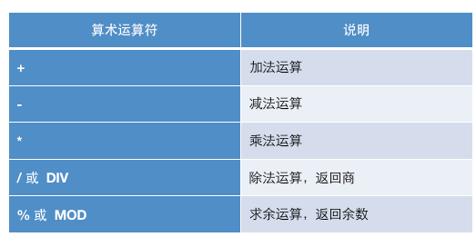
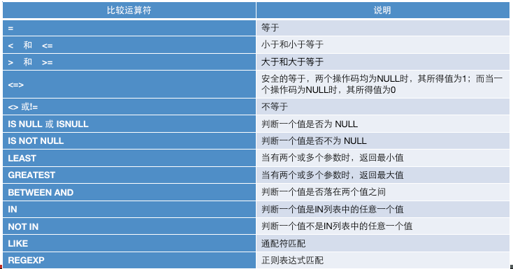
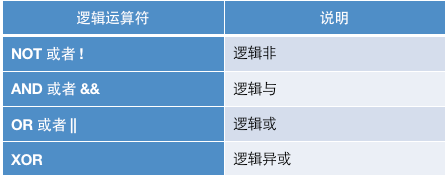
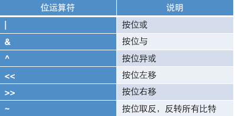
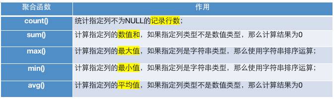

# MySQL 基础（二）

## DQL 基本查询

语法格式
```sql
select 
  [all|distinct]
  <目标列的表达式1> [别名],
  <目标列的表达式2> [别名]...
from <表名或视图名> [别名],<表名或视图名> [别名]...
[where<条件表达式>]
[group by <列名> 
[having <条件表达式>]]
[order by <列名> [asc|desc]]
[limit <数字或者列表>];

```
简化版
```sql
select *| 列名 from 表 where 条件
```

### 数据准备

创建数据库和表

```sql
drop database if exists mydb2;
create database if not exists mydb2;
use mydb2;
```

创建商品表
```sql
drop table if exists product;
create table if not exists product (
pid int primary key auto_increment comment '商品编号',
pname varchar(20) not null comment '商品名称',
price double comment '商品价格',
category_id varchar(20) comment '商品所属分类'
);
```

添加数据
```sql
insert into product values (null, '海尔洗衣机', 5000, 'c001');
insert into product values(null,'美的冰箱',3000,'c001');
insert into product values(null,'格力空调',5000,'c001');
insert into product values(null,'九阳电饭煲',200,'c001');

insert into product values(null,'啄木鸟衬衣',300,'c002');
insert into product values(null,'恒源祥西裤',800,'c002');
insert into product values(null,'花花公子夹克',440,'c002');
insert into product values(null,'劲霸休闲裤',266,'c002');
insert into product values(null,'海澜之家卫衣',180,'c002');
insert into product values(null,'杰克琼斯运动裤',430,'c002');

insert into product values(null,'兰蔻面霜',300,'c003');
insert into product values(null,'雅诗兰黛精华水',200,'c003');
insert into product values(null,'香奈儿香水',350,'c003');
insert into product values(null,'SK-II神仙水',350,'c003');
insert into product values(null,'资生堂粉底液',180,'c003');

insert into product values(null,'老北京方便面',56,'c004');
insert into product values(null,'良品铺子海带丝',17,'c004');
insert into product values(null,'三只松鼠坚果',88, null);
```
### 简单查询
```sql
-- 简单查询
select * from product;

# 查询商品名和商品价格
select `pname`, `price` from product;

# 别名查询， 使用的关键字是 as (as 可以省略)
# 表别名：
select * from product as p;
# 列别名查询
select pname as pn from product;

# 去掉重复值
select distinct price from product;

# 查询结果是表达式（运算查询）： 将所有商品的价格 + 10 元进行显示
select pname, price + 10 from product;
```

### 运算符

数据库中的表结构确立后，表中的数据代表的意义就已经确定。通过MySQL运算符进行运算，就可以获取到表结构以外的另一种数据。

例如：学生表中存在一个birth字段，这个字段表示学生的出生年月，而运用MySQL的算术运算符用当前的年份减学生出生的年份，那么的得到的就是这个学生的实际年龄数据。

MySQL支持4中运算符

- 算数运算符
- 比较运算符
- 逻辑运算符
- 位运算符

#### 算数运算符

```sql
select 6 + 2;
select 6 - 2;
select 6 * 2;
select 6 / 2;
select 6 % 2;

-- 将每件商品的价格加10
select name,price + 10 as new_price from product;
-- 将所有商品的价格上调10%
select pname,price * 1.1 as new_price from product;
```

#### 比较运算符



条件查询
```sql
select * from product where pname = '海尔洗衣机';

select * from product where price = 800;

# 不等于800
select * from product where price <> 800;

# 查询商品价格大于60的所有信息
select * from product where price > 60;

select * from product where price >= 200 and price <= 10000;

```

#### 逻辑运算符


```sql
select * from product where price >= 200 and price <= 10000;

select * from product where price = 200 or price = 800;
select * from product where price in (200, 800);

# 使用least求最小值
select least(10, 20, 30);
select least(10, null, 30);

# 使用greatest求最大值
select greatest(10, 20, 30);

```


#### 位运算符

位运算符是在二进制数上进行计算的运算符。位运算会先将操作数变成二进制数，进行位运算。然后再将计算结果从二进制数变回十进制数。

```sql
# 位运算（了解）
select 3 & 5;  # 位与
select 3 | 5;  # 位或
select 3^5;    # 位异或
select 3 >> 1; # 3 右移 1位
select 3 << 1; # 3 左移 1位
select ~3; # 取反

```

### 模糊查询
```sql
select * from product where pname like '%裤%';
# 以海开头
select * from product where pname like '海%';

# 第二个字为蔻的所有商品
select * from product where pname like '_蔻%';

# 查询category_id 为 null的商品
select * from product where category_id is null;

select * from product where category_id is not null;

```
### 排序查询

如果需要对读取的数据进行排序，我们就可以使用MySQL的`order by`字句来设定你向按哪个字段哪种方式来进行排序，再返回搜索结果。

```sql
select 
 字段名1，字段名2，……
from 表名
order by 字段名1 [asc|desc]，字段名2[asc|desc]……

```

- asc 代表升序，desc代表降序，如果不写默认升序
- order by 用于字句中可以支持单个字段，多个字段，表达式，函数，别名
- order by 字句，放在查询语句的最后面，LIMIT 字句除外
```sql
# 排序查询
# 使用价格排序（降序）
select * from product order by price desc ;
# 在价格排序的基础上，以分类排行（升序）
select * from product order by price desc , category_id asc ;

# 显示商品的价格（去重复）、并排序
select distinct price from product order by price desc ;

```
### 聚合查询
之前的查询都是横向查询，它们都是根据条件一行一行的进行判断，而使用聚合函数查询是纵向查询，它对一列的值进行计算，然后返回一个单一的值；另外聚合函数会**忽略空值**


```sql
select count(*) from product;

select count(*) from product where price > 200;

# c001所有商品价格的总和
select sum(price) from product where category_id='c001';
select max(price) from product;
select min(price) from product;
select avg(price) from product where category_id='c002';
```

NULL值的处理
1. count 函数对null值的处理
   
    如果count函数的参数为(*), 则统计所有记录的个数，而如果参数为某个字段，不会统计含null值的记录个数。
2. sum和avg函数对null值的处理
    
    这两个函数忽略null值的存在，就好像该记录不存在一样。
3. max和min函数对null值的处理
    
    max和min两个函数同样忽略null值的存在。

```sql
# null 值处理
drop table if exists test_null;
create table if not exists test_null(
    c1 varchar(20),
    c2 int
);

insert into test_null values ('aaa', 3);
insert into test_null values('bbb',3);
insert into test_null values('ccc',null);
insert into test_null values('ddd',6);

# 测试
select count(*), count(c1), count(c2) from test_null;
select sum(c2), max(c2), min(c2), avg(c2) from test_null;
```

### 分组查询
#### `group by`

分组查询是指使用`group by`字句对查询信息进行分组。

格式：
```sql
select 字段1,字段2 ... from 表名 group by 分组字段 having 分组条件;
```
操作
```sql
# 统计各个分类商品的个数
select category_id, count(*) from product group by category_id;

```
如果要进行分组的话，则SELECT字句之后，只能出现分组的字段和统计函数，其他的字段不能出现。

#### 分组之后的条件筛选-having
- 分组之后对统计结果进行筛选的话**必须使用having, 不能使用where**
- where 字句用来筛选FROM字句中指定的操作所产生的行
- group by 字句用来分组 WHERE 字句的输出
- having 字句用来从分组的结果中筛选行 

格式：
```sql
select 字段1, 字段2 ...from 表名 group by 分组字段 having 分组条件;
```
操作
```sql
select category_id, count(*) from product group by category_id having COUNT(*) > 1;
```

### 分页查询
分页查询在项目开发中常见，由于数据量很大，显示屏长度有限，因此对数据需要采取的分页显示方式。例如数据共有30条，每页显示5条，第一页显示1-5条，第二页显示6-10条。

格式：
```sql

# 方式一
select 字段1, 字段2, ... from 表名 limit n

# 方式二
select 字段1, 字段2, ... form 表名 limit m,n;

# m: 整数、表示从第几条索引开始，计算方式（当前页-1）* 每页显示条数
# n: 整数、表示查询多少条数据
```
操作：
```sql
select * from product limit 5;
select * from product limit 0,5; # 第一页数据
select * from product limit 5, 5; # 第二页数据
```

### 将一张表的数据导入到另外一张表 `INSERT INTO SELECT 和 SELECT INTO FRO`M语句

将一张表的数据导入到另外一张表中，可以使用`INSERT INTO SELECT` 语句。

格式：
```sql
insert into Table2(field1, field2,...) select value1, value2, ... from Table1;
# 或者
insert into Table2 select * from Table1;
```
要求：目标表Table2必须存在


`SELECT INTO FROM` 语句

格式：
```sql
SELECT value1, value2 into Table2 from Table1;
```

要求：目标表Table2不存在，因为插入时会自动创建表Table2，并将Table1中指定的字段数据复制到Table2中。


