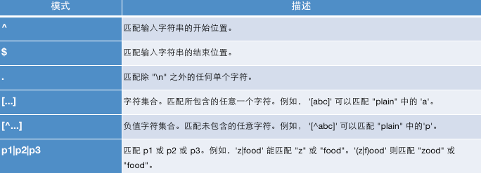

# MySQL数据库基本操作 - DQL - 正则表达式

正则表达式（regular expression）描述了一种字符串匹配的规则，正则表达式本身就是一个字符串，使用这个字符串来描述、用来定义匹配规则，匹配一系列符合某个句法规则的字符串，在开发中，正则表达式通常用来检索、替换那些符合某个规则的文本。

MySQL 通过REGEXP关键字支持正则表达式进行字符串匹配。




```sql

# ^ 在字符串开始处进行匹配
SELECT 'abc' REGEXP '^a'; # 1

# $ 在字符串末尾进行匹配
SELECT 'abc' REGEXP 'a$'; # 0
SELECT 'abc' REGEXP 'c$'; # 1

# . 匹配任意字符
SELECT 'abc' REGEXP '.b'; # 1
SELECT 'abc' REGEXP '.c'; # 1
SELECT 'abc' REGEXP 'a.'; # 1
SELECT 'abc' REGEXP 'c.'; # 0

# [...] 匹配括号内的任意单个字符
SELECT 'abc' REGEXP '[xyz]'; # 0
SELECT 'abc' REGEXP '[xaz]'; # 1

# [^...] 注意^符合只有在[]内才是取反的意思，在别的地方都是表示开始处匹配
SELECT 'a' REGEXP '[^abc]'; # 0
SELECT 'x' REGEXP '[^abc]'; # 1
SELECT 'abc' REGEXP '[^a]'; # 1

# a* 匹配0个或多个a，包括空字符串。可以作为占位符使用. 有没有指定字符都可以匹配到数据
SELECT 'stab' REGEXP '.ta*b'; # 1
SELECT 'stb' REGEXP '.ta*b'; # 1, 这里没有a 相当于空字符，也满足sta*b
SELECT '' REGEXP 'a*'; # 1

# a+ 匹配1个或者多个a，但是不包括空字符
SELECT 'stab' REGEXP '.ta+b'; # 1
SELECT 'stb' REGEXP '.ta+b'; # 0 , a+ 不能包括空字符，至少1个或多个a才行

# a? 匹配0个或者1个a
SELECT 'stb' REGEXP '.ta?b'; # 1
SELECT 'stab' REGEXP '.ta?b'; # 1
SELECT 'staab' REGEXP '.ta?b'; # 0 , 超过了1个

# a1|a2 匹配诶a1或者a2
SELECT 'a' REGEXP 'a|b'; # 1
SELECT 'b' REGEXP 'a|b'; # 1
SELECT 'b' REGEXP '^(a|b)'; # 1, ^在字符串开始处进行匹配
SELECT 'a' REGEXP '^(a|b)'; # 1
SELECT 'c' REGEXP '^(a|b)'; # 0

# a{m} 匹配m个a
SELECT 'auuuuc' REGEXP 'au{4}c'; # 1
SELECT 'auuuuc' REGEXP 'au{3}c';  # 0

# a{m,n} 匹配m到n个a，包含m和n
SELECT 'auuuuc' REGEXP 'au{3,5}c'; # 1
SELECT 'auuuuc' REGEXP 'au{4,5}c'; # 1
SELECT 'auuuuc' REGEXP 'au{5,10}c'; # 0

# (abc) abc作为一个序列匹配，不用括号括起来都是用单个字符去匹配、如果要把多个字符作为一个整体去匹配就需要用到括号、所以括号适合上面的所有情况。
SELECT 'xababy' REGEXP 'x(abab)y'; # 1
SELECT 'xababy' REGEXP 'x(ab)*y'; # 1
SELECT 'xababy' REGEXP 'x(ab){1,2}y'; # 1
```

