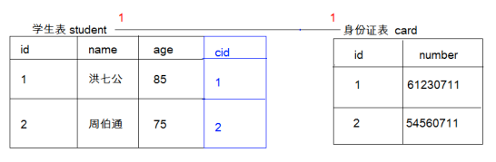
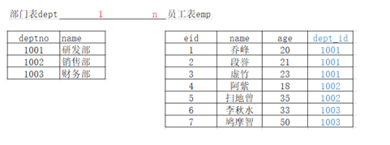
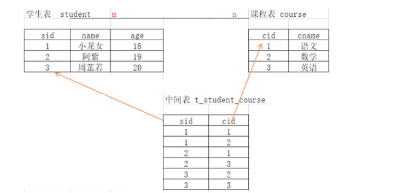
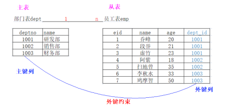
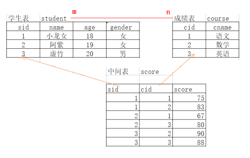
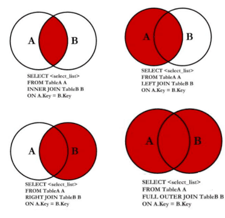

# MySQL - 多表操作

## 多表关系

实际开发中，一个项目通常需要很多张表才能完成。例如：一个商城项目就需要分类表、商品表、订单表等多张表。
且这些表的数据之间存在一定的关系。

MySQL 多表之间的关系可概括为：一对一、一对多/多对一、多对多

### 一对一
- 一个学生只有一张身份证；一张身份证只能对应一个学生。
- 在任一表中添加唯一外键，指向另一方主键，确保一对一关系。
- 一般一对一关系很少见，遇到一对一关系的表最好是合并表。




### 一对多
部门和员工

分析：一个部门有多个员工，一个员工只能对应一个部门

实现原则：在多的一方建立外键，指向一的一方的主键



### 多对多

学生和课程

分析：一个学生可以选择很多门课程，一个课程也可以被很多学生选择

原则：多对多关系实现需要借助第三张中间表。中间表至少包含两个字段，将多对多的关系，拆成一对多的关系，中间表至少要有两个外键，这两个外键分别指向原来的那两张表的主键。




## 外键约束

介绍：MySQL 外键约束（FOREIGN KEY） 是表的一个特殊字段，经常与主键约束一起使用。对于两个具有关联关系的表而言，相关联字段中主键所在的表就是主表（父表），外键所在的表就是从表（字表）。

外键用来建立主表与从表的关联关系，为两个表的数据建立连接，约束两个表中数据的一致性和完整性。比如：一个水果摊，只有苹果、桃子、李子、西瓜等4中水果，那么，你来到水果摊要买水果就只能选择苹果、桃子、李子和西瓜，其他的水果都是不能买的。



特点：定义一个外键时，需要遵守下列规则：
- 主表必须已经存在于数据库中，或者当前正在创建的表。
- 必须为主表定义主键
- 主键不能包含空值，但允许在外键中出现空值。也就是说，只要外键的每个非空值出现在指定的主键中，这个外键的内容就是正确的。
- 在主表的表名后面指定列名或者列名的组合。这个列或列的组合必须是主表的主键或候选键。
- 外键中列的数目必须和主表的主键中列的数目相同
- 外键中列的数据类型必须和主表主键中对应列的数据类型相同

### 创建外间约束

**方式一：** 在创建表时设置外键约束，在`create table ` 语句中，通过`foreign key` 关键字来指定外键。

```sql
[constraint <外键名>] foreign key 字段名 [, 字段名2, ...] reference <主表名> 主键列1 [, 主键列2, ...]
```

实现：

```sql
DROP DATABASE IF EXISTS mydb3;
CREATE DATABASE IF NOT EXISTS mydb3;
USE mydb3;

# 创建部门表
create table if not exists dept(
    deptno VARCHAR(20) PRIMARY KEY  COMMENT '部门号',
    name VARCHAR(20) NOT NULL DEFAULT '' COMMENT '部门名字'
);

# 创建员工表
DROP TABLE IF EXISTS `emp`;
CREATE TABLE IF NOT EXISTS `emp`(
   `eid` VARCHAR(20) PRIMARY KEY COMMENT '员工编号',
   `ename` VARCHAR(20) COMMENT '员工名字',
   `age` INT COMMENT '员工年龄',
   `dept_id` VARCHAR(29) COMMENT '员工所属部门',
   # 添加外键约束
   CONSTRAINT `emp_fk` FOREIGN KEY (`dept_id`) REFERENCES `dept` (`deptno`)
);

```

**方式二：** ：外键约束也可以在修改表时添加，但是添加外键约束的前提是：从表中外间列中的数据必须与主表中主键列中的数据一致或者没有数据。
```sql
alter table <表名> add constraint <外键名> foreign key (<列名>) references <主表名> (<列名>);
```

### 数据插入

在外键约束下的数据操作

```sql
-- 1、添加主表数据
-- 注意必须先给主表添加数据
insert into dept values('1001','研发部');
insert into dept values('1002','销售部');
insert into dept values('1003','财务部');
insert into dept values('1004','人事部');

-- 2、添加从表数据
  -- 注意给从表添加数据时，外键列的值不能随便写，必须依赖主表的主键列
insert into emp values('1','乔峰',20, '1001');
insert into emp values('2','段誉',21, '1001');
insert into emp values('3','虚竹',23, '1001');
insert into emp values('4','阿紫',18, '1002');
insert into emp values('5','扫地僧',35, '1002');
insert into emp values('6','李秋水',33, '1003');
insert into emp values('7','鸠摩智',50, '1003');
# insert into emp values('8','天山童姥',60, '1005');  -- 不可以
```
### 删除数据

在外键约束下的数据操作

```sql
-- 删除数据
 /*
   注意：
       1：主表的数据被从表依赖时，不能删除，否则可以删除
       2: 从表的数据可以随便删除
 */
delete from dept where deptno = '1001'; -- 不可以删除
delete from dept where deptno = '1004'; -- 可以删除
delete from emp where eid = '7'; -- 可以删除

```

### 删除外键约束
当一个表中不需要外键约束时，就需要从表中将其删除。外键一旦删除，就会解除主表和从表间的关联关系

格式：
```sql
alter table <表名> drop foreign key <外键约束名>;
```
```sql
alter table emp2 drop foreign key dept_id__fk;
```

### 多对多关系

在多对多关系中，A表的一行对应B的多行，B表的一行对应A表的多行，我们要新增加一个中间表，来建立多对多关系。



```sql
-- 学生表和课程表(多对多)
  -- 1 创建学生表student(左侧主表)
   create table if not exists student(
    sid int primary key auto_increment,
    name varchar(20),
    age int,
    gender varchar(20)
   );
  -- 2 创建课程表course(右侧主表)
  create table course(
   cid  int primary key auto_increment,
   cidname varchar(20)
  );

-- 3创建中间表student_course/score(从表)
create table score(
    sid int,
    cid int,
    score double
);

-- 4建立外键约束(2次)
alter table score add foreign key(sid) references student(sid);
alter table score add foreign key(cid) references course(cid);

-- 5给学生表添加数据
insert into student values(1,'小龙女',18,'女'),(2,'阿紫',19,'女'),(3,'周芷若',20,'男');
-- 6给课程表添加数据
insert into course values(1,'语文'),(2,'数学'),(3,'英语');
-- 7给中间表添加数据
insert into score values(1,1),(1,2),(2,1),(2,3),(3,2),(3,3);

```

## 多表联合查询

多表查询就是同时查询两个或两个以上的表，因为有的时候用户在查看数据的时候，需要显示的数据来自多张表

多表查询分类：
- 交叉连接查询[产生笛卡尔积，了解] 语法：`select * from A,B`
- 内连查询（使用的关键字 inner join -- inner可以省略）
  - 隐式内连接（SQL92标准）：`select * from A,B where条件`；
  - 显示内连接（SQL92标准）：`select * from A inner join B on 条件`;
- 外连接查询（使用的关键字 outer join -- outer 可以省略）
  - 左外连接：`left outer join`：`select * from A left outer join B on 条件`;
  - 右外连接：`right outer join`：`select * from A righht outer join B on 条件`;
  - 满外连接：`full outer join`： `select * from A full outer join B on 条件`;




## 子查询
select 的嵌套

## 自关联查询
将一张表当成多张表来用


